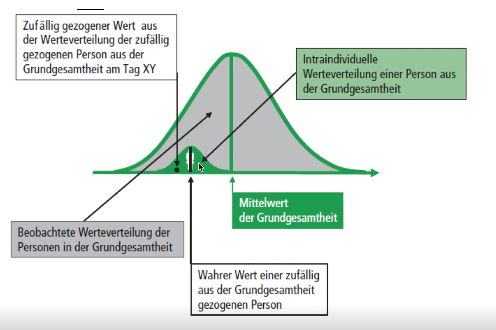
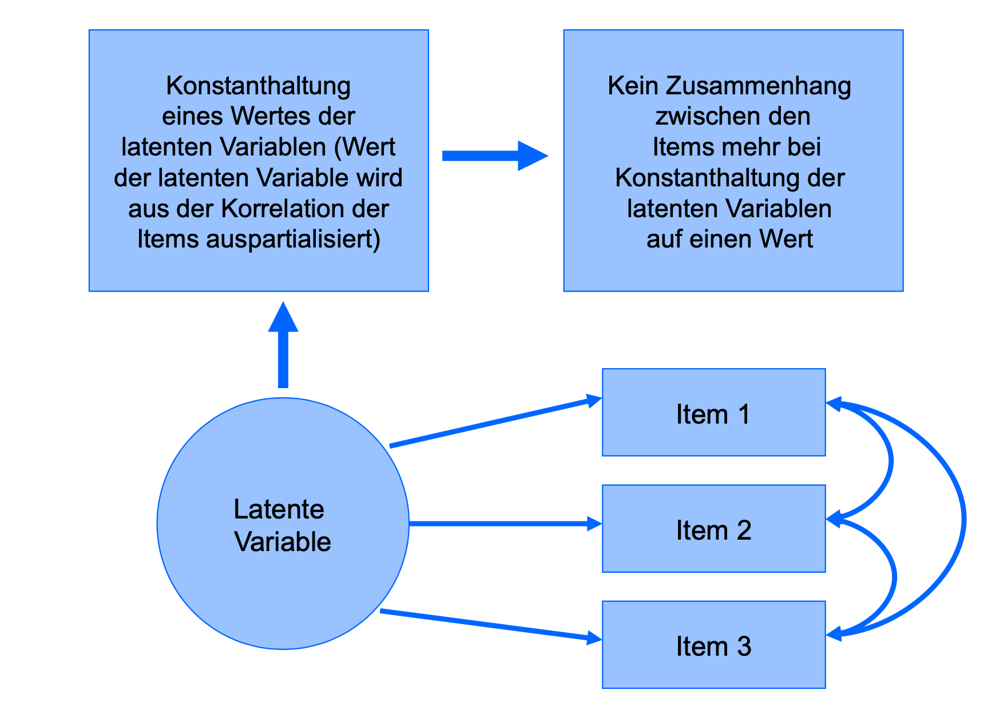

```{r setup, include=FALSE}
knitr::opts_chunk$set(
	echo = FALSE,
	message = FALSE,
	warning = FALSE
)
pkgs <- c("psych", "paran", "rmarkdown", "bibtex", "base", "stats", "graph")
lapply(pkgs, library, character.only=TRUE)
knitr::write_bib(pkgs, file = "./references.bib")
refs <- bibtex::read.bib("references.bib")
keys <- names(refs)
```

# Einstieg: Forschungsthemen-Wunschliste

Stellen Sie sich vor, Sie dürfen völlig frei ein Thema für eine Forschungsarbeit
wählen. Was würden Sie untersuchen?

## Auflösung: das Interesse an komplexen Phänomenen

Viele Sozialwissenschaftler/innen haben ein ausgeprägtes Interesse
an komplexen (oft unbeobachtbaren) sozialwissenschaftlichen Konstrukten (z.B.
Intelligenz, Narzissmus, Ehre, Liebe, Depression...).

$\longrightarrow$ die Bürde der Messung komplexer Phänomene

Zentrale Konzepte der KTT sind hierbei:

1. Messfehler
2. Wahrer Wert
3. Reliabilität

# Die Bürde komplexer Messungen

## Die Bürde komplexer Messungen: Messfehler 

> "Psychological measurement can be a difficult task. We aim to measure not
directly observable variables like cognitive abilities, personality traits,
motivation, quality of life, diseases in psychopathology, etc. Measuring such
latent constructs is much more challenging than determining body height or
weight (for which we have a measuring tape and a scale as measurement
instruments). Obviously we cannot simply ask: “How depressed are you?” or “How
intelligent are you?”. We need a measurement instrument such as a test or
questionnaire to assess a participant’s location on the underlying latent
variable." ([Mair, 2018, S. 1](https://www.springer.com/gp/book/9783319931753))

## Zusammenhang: komplexe Messung & Testtheorie

- Ausgangspunkt 

\begin{block}{Die Bürde der Messung komplexer Phänomene}
Als Sozialwissenschaftler*inn ist man häufig dazu "verdammt",
latente Konstrukte mit \textit{Messfehler} zu erfassen.
\end{block}

$\Rightarrow$ *Theorie über die Entstehung des Messfehlers* (Messfehlertheorie).

- Beispieltheorie: Klassische Testtheorie (KTT)
  - Erklärung: Wahrer Wert = Beobachtungswert + Messfehler 
- (...demnächst: Item Response Theory (IRT))

# Messfehler & True Scores in der KTT

## Zusammenhang: Messfehler & True Score

Aus der formalen Darstellung der Bürde der Messung komplexer Phänomene..

\begin{equation}
  X = \tau - \epsilon  
\end{equation}

..folgt logisch äquivalent..

\begin{alertblock}{Definition: True Score}
  \begin{equation}
    \tau = X + \epsilon 
  \end{equation}
\end{alertblock}

- $X$: Beobachtungswert (bekannt)
- $\tau$: Wahrer Wert (unbekannt)
- $\epsilon$: Fehlerkomponente, Messfehler (unbekannt)

<!-- ## Lantent variable logic & inference  -->
<!--   Crux: lantent variable logic  -->
<!--        LV (Konstrukt) -> OV (Verhalten, Item)  -->
<!--        LV (Konstrukt) <- Testtheorie — OV (Verhalten, Item)  -->

## Grundannahme der Messfehlertheorie (KTT)

\begin{block}{Grundannahme: unsystematische Fehlerkomponente}
 \begin{equation}
    E(\epsilon) = 0
 \end{equation}
\end{block}

```{r, out.width="80%", results='hide', fig.align='center'}
old.par <- par(no.readonly=TRUE)
par(mfrow=c(1,2))
plot(rnorm(100), ylab = "Fehlerkomponente")
abline(h=0, lty=2)
mtext("unsystematische Fehlerkomponente")

seq <- seq(1, 100)
f <- function(x) 3*x + rnorm(1, 0, 50)
plot(sapply(seq, f), ylab = "Fehlerkomponente")
abline(h=0, lty=2)
mtext("systematische Fehlerkomponente")
```

## Warum eine unsystematische Fehlerkomponente?

\begin{alertblock}{Fluktuationsphänomen}
"Adding small fluctuations tend to dampen one another!" (McElreath, 2020, S.73)
\end{alertblock}

Kniff: Unter der KTT-Annahme "unsystematischer Störeinflüsse" (=Fluktuationen),
gleichen sich die Messfehler im Mittel aus, sodass der Messwert ($X$) dem wahren
Wert ($\tau$) entspricht.

\begin{equation}
E(X_{j=1, \dots, M}) = \tau  \quad | \quad  \epsilon \sim Normal(0, \sigma)
\end{equation}

1. Beispiel: Revelle's Münzwurf
2. Beispiel: die verflixte Waage

## Beispiel 1: Fluktuationsphänomen (Revelle's Münzwurf)

 >"Consider a simple case of asking students their ages but to insure privacy,
 asking them to flip a coin before giving their answer. If the coin comes up
 heads, they should add 1 to their real age, if it comes up tails, they should
 subtract 1. Clearly no observed score corresponds to the true scores. But if
 we repeat this exercise 10 times, then the mean for each student will be quite
 close to their true age". 
 ([Revelle, in prep., S. 207](https://personality-project.org/r/book/Chapter7.pdf))
 
## Let's do it! (..in R) 

```{r include=FALSE}
set.seed(123)
```
```{r echo=TRUE}
true_age <- 28 
add_privacy <- function(true_age){
  # heads or tails
  hot <- sample(c(0,1), 1, replace = TRUE)
  ifelse(hot==1, true_age+1, true_age-1)
}
# Anzahl der Messwiederholungen
M <- 10 
reps <- replicate(M, add_privacy(true_age))
mean(reps)
```

## Beispiel 2: Fluktuationsphänomen (verflixte Waage)

```{r include=FALSE}
set.seed(123)
```
```{r echo=TRUE}
true_weight <- 67
crazy_scale <- function(true_weight){
  # 5kg +/- 
  rnorm(1, true_weight, 5)
}
# Anzahl der Messwiederholungen
M <- 100000
reps <- replicate(M, crazy_scale(true_weight))
mean(reps)
```

## Grafik: Die verflixte Waage

```{r, out.width="80%", results='hide', fig.align='center'}
hist(reps, main=NA, xlab = "Messergebnis(se)", ylab = "Häufigkeiten")
abline(v=67, lty=2)
mtext("Verteilung der Messergebnisse (M=100.0000)")
```

## Übungsaufgabe 1: Selbstexperiment

\begin{example}
Versuchen Sie es selbst! Nutzen Sie den Code zur Übungsaufgabe 1 in
\texttt{04-KTT.R}. Geben Sie ihr eigenes Alter/Gewicht ein und verändern Sie den
Wert für \texttt{M}.
\end{example}

1. Wie verändert sich der Wert mit steigender Wiederholungszahl? 
2. Ab wann sind die Veränderungen konstant?

- Zeit: 5 Minuten
- Replikation: \texttt{set.seed(123)} 
- Anmerkung: Konzepte verstehen $\gg$ Codes verstehen!

## True Score Logik: ein Gedankenexperiment

..in (etwas) abstrakteren Worten entspricht die True-Score-Logik der KTT einem
Gedankenexperiment (siehe VL-Folien)

\begin{block}{Gedankenexperiment}
Hätten wir die Möglichkeit eine Person i unzählige Male zu unter den gleichen
Bedinungen zu messen (m=1,...,M), dann erhalten wir eine (Normal-)verteilung
seiner Messwerte (unter der Annahme $E(\epsilon) = 0$)), wobei im Mittel über
alle \textit{intraindividuellen} Messwerte ($X_j = 1, \dots, M$) die
Beobachtungswerte dem wahren Wert der Person entsprechen
\end{block}

\begin{equation}
E(X_{j=1, \dots, M}) = \tau  \quad | \quad  \epsilon \sim Normal(0, \sigma)
\end{equation}

<!-- Herleitung -->

## Let's do it! (..in R) 

```{r echo=TRUE}
set.seed(123)
# Anzahl der Messwiederholungen
M <- 10000
# True Score(s) (z.B. Intelligenztest)
T <- 100 
# Zufallsfehler; Schwankungsbreite +/- 10
E <- rnorm(M, 0, 10)
# Beobachtungswerte
X <- T + E 
# (Imaginäre() Wiederholung der Testung 
reps <- replicate(M, sample(X, 1))
```

## Ergebnisse: Intraindividuelle Merkmalsverteilung

```{r}
# Intraindividuelle Merkmalsverteilung 
hist(reps, main = NULL, xlab="Testwert", 
     ylab="Häufigkeiten")
mtext("Intraindividuelle Merkmalsverteilung (M = 10.000)")
```

## Ergebnisse: Beobachtungs- & Erwartungswert  

```{r echo=TRUE}
set.seed(123)
# Ein zufällig gezogener Beobachtungswert
(X_i <- sample(X, 1))
# Erwartungswert des Individuums: T = E(X) 
(E_X <- mean(reps))
```

## Übungsaufgabe 2: Selbstexperiment

\begin{example}
Versuchen Sie es selbst! Nutzen Sie den Code zur Übungsaufgabe 2 in
\texttt{04-KTT.R}. Geben Sie ihr eigenes Alter/Gewicht ein und verändern Sie den
Wert für \texttt{M}.
\end{example}

1. Wie verändert sich der Wert mit steigender Wiederholungszahl? 
2. Ab wann sind die Veränderungen konstant?

- Zeit: 10 Minuten
- Replikation: \texttt{set.seed(123)} 
- Anmerkung: Konzepte verstehen $\gg$ Codes verstehen!

## Auflösung: Veränderung in Abhängigkeit der Wiederholungszahl 

```{r, out.width="80%", results='hide', fig.align='center'}
set.seed(123)
# True Score
T <- 100
generator <- function(M, T){
# Faster implementation
mean(rnorm(M, T, 5))
}
seq <- c(1:10, 100, 1e3, 1e4, 1e5, 1e6) 
E_X <- lapply(seq, generator, T=T)
plot(1:length(seq), E_X, xaxt='n', xlab = "N", ylab = "Erwarungswert von X",
     type="b", lty=2)
axis(side = 1,  1:length(seq), as.character(seq))
abline(h=T, lty=2)
text(c(3,T+.3), labels = "True Score")
mtext("Approximation von T bei imaginären Wiederholungszahlen des Tests")
```

## Erweiterung: die True Score Logik der KTT

Um die True Score Logik zu verinnerlichen, wollen wir die einzelnen Konzepte in
R umsetzen und mit den Kennwerten "herumspielen" um eine Intuition für das Konzept zu
bekommen; v.a.:

1. Interindividuelle Merkmalsverteilung
2. Intrainduviduelle Merkmalsverteilung
3. Wahrer Wert, Beobachtungswert & Fehlerkomponente ($\tau, X, \epsilon$)

## Zur Verortung: Kernkonzepte

{width=75%, height=75%}

## Anwendungsbeispiel: Intelligenztest

\begin{block}{Gedankenexperiment}
Stellen Sie sich vor wir würden mit 10.000 Probanden einen Intelligenztest
durchführen, indem jeder Proband 5000 mal den gleichen Intelligenztest
wiederholt.
\end{block}

## Populationen: Individuen & Messwerte

..dazu ziehen wir (zufällig) aus einer normalerweise unbekannten Population
N=10.000 Personen mit den True Scores ($\tau$)

```{r include=FALSE}
set.seed(123)
```
```{r echo=TRUE}
# Populationsgröße 
N <- 10000
# Generierung der True Scores
# 100: Mittlere Intelligenz in der Population
# 30: Abweichungen vom Populationnsmittelwert
T <- round(rnorm(N, 100, 30), digits = 0)
# Anzahl der (imaginären) Testwiederholungen
M <- 5000 
X <- lapply(T, function(T) rnorm(M, T , 5))
names(X) <- T
```

## Verteilung der True Scores in der Population

...die uns unbekannten True Scores sind gemäß der Simulation wie folgt verteilt

```{r, out.width="80%", results='hide', fig.align='center'}
hist(T, main = NULL, xlab = "True Scores", ylab = "Häufigkeiten")
mtext("Verteilung der wahren Intelligenzwerte in der Population (N = 10000, M = 5000)")
```

## Interindividuelle Merkmalsverteilung

...mitteln wir die 5000 durchgeführten Testergebnisse ($X_{j = 1,\dots,5000}$)
für jede Person ($i = 1,\dots,10000$) und plotten diese, dann erhalten wir die
interindividuelle Merkmalsverteilung ($E(X) \approx T$)

```{r, out.width="80%", results='hide', fig.align='center'}
hist(rapply(X, mean), main = NULL, xlab="intraindiviueller Erwartungswert",
     ylab = "Häufigkeiten")
mtext("Veteilung der erwarteten Intelligenzwerte in der Population (M = 5000)")
```

## Intraindividuelle Merkmalsverteilungen  

...aus dieser Population (interindividueller Merkmalsverteilung) ziehen wir
zufällig 4 Probanden/Probandinnen und betrachten ihre intraindividuellen
Merkmalsverteilung über die 1000 Testwiederholungen.

```{r include=FALSE}
set.seed(123)
```
```{r, out.width="80%", results='hide', fig.align='center'}
rnd_smpl <- sample(X, 4)
old.par <- par(no.readonly = TRUE)
par(mfrow=c(2,2))
lapply(rnd_smpl, hist, main=NULL, xlab="Testwert", sub=paste0("(M=", M,")"))
par(old.par)
```

## Intraindividuelle Merkmalsverteilungen

..da wir nur ein einzes Mal messen, ziehen wir (zufällig) einen Wert aus der
(Normal-)verteilung der intraindividuellen Messwerte. Dieser intraindividuelle
Messwert ($X_{ij}$) ist ein *Schätzer* für den True Score ($\tau_{i}$) der Person
der wegen des Messfehlers unter oder über dem Messwert liegt. Sehen Sie selbst...

<p>&nbsp;</p>

```{r include=FALSE}
set.seed(123)
```
```{r echo=TRUE}
# Zufallszug eines Individuums aus der Population
X_i <- sample(X, 1) 
# Zufallszug eines Testwertes der Person 
(X_ij <- sample(X_i[[1]], 1)) ; names(X_i)
```

## Übungsaufgabe 3: Selbstexperiment

\begin{example}
Versuchen Sie es selbst! Nutzen Sie den Code zur Übungsaufgabe 3 in
\texttt{04-KTT.R}. Ziehen Sie aus unserer Population immer wieder zufällig neue
Probanden. Die nachfolgende Funktion \texttt{rsample()} erleichtert Ihnen den
Prozess. Führen Sie diese deshalb immer wieder aus.
\end{example}

Wie verändern sich Wahrer Wert, Beobachtungswert und Messfehler?

- Zeit: 10 Minuten
- Replikation: \texttt{set.seed(123)} 
- Anmerkung: Konzepte verstehen $\gg$ Codes verstehen!

## Hilfsfunktion: rsample_i()

```{r include=FALSE}
set.seed(123)
```
```{r echo=TRUE}
rsample_i <- function(){
  # Zufallszug eines Individuums 
  X_i <- sample(X, 1) 
  # Zufallszug eines Testwertes 
  X_ij <- sample(X_i[[1]], 1)
  cat("True Score (T):", names(X_i), "\n", 
      "Testwert (X):", round(X_ij), "\n", 
      "Messfehler (E):", 
      abs(round(X_ij) - as.numeric(names(X_i))))}
# Automatisierung 
rsample_i()
```

## Übungsaufgabe 4: Selbstexperiment

\begin{example}
Versuchen Sie es selbst! Nutzen Sie den Code zur Übungsaufgabe 4 in
\texttt{04-KTT.R}. Erstellen Sie ihre eigenen Populationen und variieren Sie
systematisch die Werte $M$ und $N$. (siehe: Übungsaufgabe 4)
\end{example}

1. Wie äußern sich Veränderungen in der Wiederholungszahl ($M$) ?& Populationsgröße ($N$)
2. Wie wirken sich die Veränderungen auf den Zusammenhang zwischen Wahrem Wert,
Beobachtungswert und Messfehler aus (Tipp: $\tau = X + \epsilon$)

- Zeit: 10 Minuten
- Replikation: \texttt{set.seed(123)} 
- Anmerkung: Konzepte verstehen $\gg$ Codes verstehen!

## Zwischenfazit: Was wissen wir bisher?

{width=50%, height=50%}

## Eine (bisher) noch ungeklärte Frage

> "Das zentrale Konzept der klassischen Testtheorie ist die Reliabilität, das
ist die Zuverlässigkeit bzw. Genauigkeit[...], mit der ein Testwert den wahren
Wert erfasst." [(wikipedia.de)](https://de.wikipedia.org/wiki/Klassische_Testtheorie)

<p>&nbsp;</p>

\begin{block}{Rückfrage: Reliabilität $\sim$ Messfehler}
Jetzt haben wie so viel über Messfehler gesprochen. Wie hängen nun aber die zwei
zentralen Konzepte der KTT (Messfehler \& Reliabilität) zusammen?
\end{block}

Anmerkungen: Nehmen Sie dazu an der nachfolgenden Mentimenter-Umfrage teil!

## Brainstorming: Reliabilität & Messfehler 

Wie hängen Reliabilität und Messfehler zusammen?

{width=50%, height=50%}

# Reliabilität

## Was ist Reliabilität?

Die Reliabilität (=Besätndigkeit/Genauigkeit) wird definiert als Anteil
($Var(\tau_j)$) der wahren Varianz an der Gesamtvarianz ($Var(Y_j)$).

\begin{alertblock}{Definition: Reliabilität}
\begin{equation}
  Rel(Y_j) = \frac{Var(\tau_j)}{Var(Y_j)} = \frac{Var(\tau_j)}{Var(\tau_j) + Var(\epsilon_j)}
\end{equation}
\end{alertblock}

- $Rel \in [0,1]$
- $Rel = 0$: ausschließlich Messfehler 
- $Rel = 1$: gar kein Messfehler 

## Zusammenhang: Reliabilität & Messfehler 

```{r include=FALSE}
set.seed(123)
```
```{r echo=TRUE}
N <- 1000 # Verändere mich
tau <- rnorm(N, mean = 100, 30)
var_epsilon <- 25 # (25): Verändere mich!
epsilon <- rnorm(N, 0, var_epsilon) 
reliab <- function(tau, epsilon){
 rel <- var(tau) / var(tau + epsilon)
 cat("Reliabilität der Messung:", rel)
}
reliab(tau, epsilon)
```

## Übungsaufgabe 5: Selbstexperiment

\begin{example}
Versuchen Sie es selbst! Nutzen Sie den Code zur Übungsaufgabe 5 in
\texttt{04-KTT.R}. Verändern Sie die Varianz im Fehlerterm und schauen Sie auf
die Veränderung in der Reliabilität der Testergebnisse.
\end{example}

Wie wirken sich eine steigende Varianz im Fehlerterm auf die Reliabilität der
Messung aus? (Tipp: $Rel(Y_j) = \frac{Var(\tau_j)}{Var(\tau_j) + Var(\epsilon_j)}$)

- Zeit: 10 Minuten
- Replikation: \texttt{set.seed(123)} 
- Anmerkung: Konzepte verstehen $\gg$ Codes verstehen!

## Auflösung: Reliabilität & Messfehler

```{r, out.width="80%", results='hide', fig.align='center'}
set.seed(123)
reliab <- function(var_epsilon){
  N <- 1000
  tau <- rnorm(N, mean = 100, 30)
  epsilon <- rnorm(N, 0, var_epsilon) 
  var(tau) / var(tau + epsilon)
}
var_epsilon <- seq(0, 200, 5)
plot(sapply(var_epsilon, reliab), xaxt='n', ylim = c(-0.01, 1),
     xlab="Varianz in Epsilon", ylab="Reliabilität")
axis(side = 1,  1:length(var_epsilon), as.character(var_epsilon))
abline(h=c(0,1), lty=2) 
text(x= 7, y= 0.1, "Minimum") ; text(x= 35, y= 0.9, "Maximum")
```

Die Reliabilität ist also ein Maß für die Messfehlerfreiheit einer Messung!

<!-- # Messmodelle (..to be continued!) -->

<!-- \begin{alertblock}{Messmodelle \& Messäquivalenz} -->
<!--   Inwieweit messen wir mit unterschiedlichen Tests dasselbe Konstrukt? -->
<!-- \end{alertblock} -->

<!-- Anmerkung: unterschiedliche Messmodelle bedingen unterschiedliche -->
<!-- Reliabilitätskoeffizienten. -->

<!-- ..Fortsetzung in der Übnung zur Reliabilität folgt. -->

## Zusammenfassung: KTT in a Nutshell 

> "The classical test theory model is the theory of psychological testing that is
most often used in empirical applications. The central concept in classical test
theory is the true score. True scores are related to the observations through
the use of the expectation operator: the true score is the expected value of the
observed score. Thus, a researcher who sees intelligence as a true score on an
intelligence test supposes that somebody’s level of intelligence is his expected
score on an IQ-test."
> ([Borseboom 2005, S. 3](https://doi.org/10.1017/CBO9780511490026))
>

## Abschließende Anmerkung

> "However, although various authors have warned against it, the platonic true
score interpretation is like an alien in a B-movie: no matter how hard you beat
it up, it keeps coming back."
>
> ([Borseboom 2005, S. 32](https://doi.org/10.1017/CBO9780511490026))

Probleme der True Score Logik

- z.B.: die Grundgleichung bleibt empirisch ungeprüft ($\tau = X + \epsilon$)
- z.B.: Annahme zu Messfehlern oft problematisch ($E(\epsilon)=0$)
- z.B.: [Kohli et al. (2015)](https://doi.org/10.1177/0013164414559071) Nur
moderne Erweiterungen der KTT (v.a. Underlying Normal Variable Approach) können
annähernd mit modernen Item Response Theory Model (IRT) mithalten.

$\Rightarrow$ Moderne Ansätze zur Verebsserung (..to be continued!) 

# Bonusmaterial: Lokale Unabhängigkeit

## Lokale Unabhängigkeit

\begin{alertblock}{Lokale Unabhängigkeit}
Lokale Unabhängigkeit $\Leftrightarrow$ die Itemantworten sind unter Kontrolle
der Traitausprägung unabhängig voneinander
\end{alertblock}

- Die Logik lantenter Variablen (2.0)

\begin{equation}
  \zeta: gen. process \rightarrow VAR(j = 1, \dots, M) : cor(j, k) > 0)
\end{equation}

- Die Logik lokaler Unabhängigkeit

\begin{equation}
  cor(j, k) | \zeta = 0
\end{equation}

- $\zeta$: Konstrutk (latente Variable)
- $j,k$: Items in einem Test (beobachtete Variablen)
- $M$: Anzahl der Items in einem Test 

<!-- Latent variable logic: Beinflusst die LV die OVs, kovariieren die Items -->
<!-- miteinander (LV_gen.process -> VAR(OVs) : cor(i, j) > 0). Ist die LV der -->
<!-- einzige Grund warum die Items korrelieren, dann sollte der Zusammenhang unter -->
<!-- Kontrolle der LV verschwinden. Die Items sind dann LSU und die LV erklärt/saugt -->
<!-- die gesamte Varianz zwischen den Items. Die Varianzaufklärungsmission ist damit -->
<!-- beendet (cov(i,j) = 0 | LV). D.h. OV := Indikator für LV <=> OVs lokal -->
<!-- statistisch unabhängig. -->

<!-- Hängt jedoch die Antworten zweier Items zusammen, dann korrelieren sie -->
<!-- ebenfalls miteinander -- auch unabhängig von der LV. Unter Kontrolle der LV -->
<!-- bleibt damit ein Rest übrig (d.h. nicht die gesamte Varianz wird durch die LV -->
<!-- herauspatrialisiert/-gesaugt). Die vollständige Varianzaufklärungsmission (im -->
<!-- Sinne der LV) ist damit gescheitert. -->

## Grafik: Logik Lokaler Unabhängigkeit

{width=75%, height=75%}

## Grafik: Lokale Unabhängigkeit & Korrelationsmatrix

Wie überträgt sich dieses Prinzip auf die Itemantworten und damit auf die
Korrelationsmatrix?

```{r, out.width="100%", results='hide', fig.align='center'}
old.par <- par(no.readonly = TRUE)
par(mfrow=c(1,2))
set.seed(359)
# Define factor loadings
loads <- rep(0.7, 10)
# Sample correlation matrix
R_1 <- psych::sim.congeneric(loads=loads,N=50)
X_2 <- replicate(10, rnorm(100)) 
R_2 <- cor(X_2) 
attributes(R_2) <- attributes(R_1)
# Visualize the correlation matrix
corrplot::corrplot.mixed(R_1, number.cex=.7)
mtext("Vor Kontrolle der Traitausprägung")
corrplot::corrplot.mixed(R_2, number.cex=.7)
mtext("Nach Kontrolle der Traitausprägung")
```

## Lokale Unabhängigkeit ($\sim$ Korrelationsmatrizen) II

\begin{example}
Stellen Sie sich vor, nach Kontrolle der Traitausprägung sieht Ihre
Korrelationsmatrix wie folgt aus. Zu welchen Schluss kommen Sie bezüglich der
Annahme lokal statistischer Unabhängigkeit? Warum?
\end{example}

```{r include=FALSE}
set.seed(123)
```
```{r, out.width="50%", results='hide', fig.align='center'}
loads <- rep(0.4, 10)
R <- psych::sim.congeneric(loads=loads,N=50)
# Visualize the correlation matrix
corrplot::corrplot.mixed(R, number.cex=.7)
```

# Selbststudium

## Zum Problem(?) systematischer Störeinflüsse

\begin{block}{Ausganssituation}
Da die KTT nur unsystamtische Störeinflüsse berücksichtigt,
bleiben systematische Einflüsse unberücksichtigt.
\end{block}

z.B.: soziale Erwünschtheit, politische Korrektheit

Frage: Wie wirken sich systematische Störeinflüsse aus? 

- z.B. auf Korrelationen?
- z.B. auf Regressionsgewichte?

## Auswkirungen system. Störeinflüsse: Korrelationen

\begin{block}{Szenario}
Systematischer Einfluss über alle Fälle hinweg
\end{block}

```{r include=FALSE}
set.seed(123)
```
```{r echo=TRUE}
n <- 100
x <- rnorm(n)
y <- rnorm(x)
cor(x, y) ; cor(x+3, y) ; cor(x, y + 3) ; cor(x + 3, y + 3)
```

## Auswikrungen system. Störeinflüsse: Korrelationen

\begin{block}{Szenario}
Systematischer Störeinfluss auf einige (die ersten 50) Probanden  
\end{block}

```{r echo=TRUE}
x[1:50] <- x[1:50] + 3
cor(x, y) 

# Additional increase MME
x[1:50] <- x[1:50] + 6
cor(x, y) 
```

## Auswirkungen system. Störeinflüsse: Regressionsgewichte 

\begin{block}{Szenario}
Systematischer Einfluss über alle Fälle hinweg
\end{block}

```{r include=FALSE}
set.seed(123)
```
```{r echo=TRUE}
x <- rnorm(100) ; y <- rnorm(x)
# Original result
lm(y ~ x)$coef[[2]] 
# Manipulatied predictor 
beta_ast <- lm(y ~ I(x+3))$coef[[2]] 
# Manipulatied outcome 
lm(I(y+3) ~ I(x))$coef[[2]] 
```

## Auswirkungen system. Störeinflüsse: Regressionsgewichte 

\begin{block}{Szenario}
Systematischer Störeinfluss auf einige (die ersten 50) Probanden  
\end{block}

```{r include=FALSE}
set.seed(123)
```
```{r echo=TRUE}
x <- rnorm(100) ; y <- rnorm(x)
x[1:50] <- x[1:50] + 3
beta <- lm(y ~ x)$coef[[2]] 
# Manipulatied predictor 
x[1:50] <- x[1:50] + 6
# Manipulatied coefficient 
lm(y ~ x)$coef[[2]] 
```

## Literaturverzeichnis {.allowframebreaks} 

