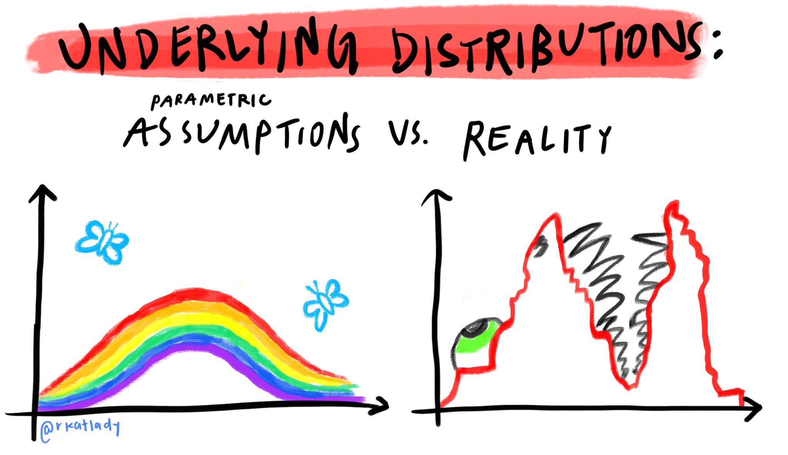
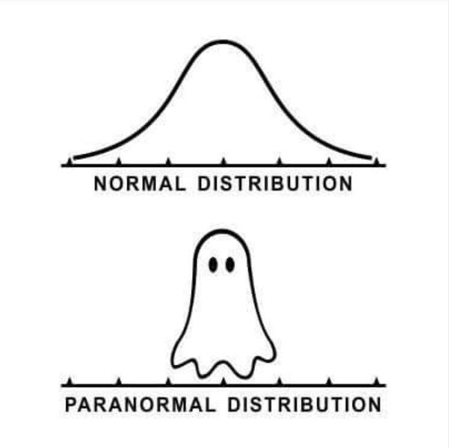

```{r setup, include=FALSE}
knitr::opts_chunk$set(echo = FALSE)
```

# Steven, Marcel Bißantz

## @findme 

- Github: [sbissantz](https://github.com/sbissantz)
- ORCID: [0000-0002-1109-786X](https://orcid.org/0000-0002-1109-786X)
- Mail: [bissantz@uni-landau.de](mailto:bissantz@uni-landau.de)

## Bachelorstudium(s)

B.A. Soziologie

## Masterstudium(s)

M.A. Sozialwissenschaften 

## Promotionsstudium

# Ich & Testtheorie
(...a long way gone)

## elisr
- <https://sbissantz.github.io/elisr/>
- <https://github.com/sbissantz/elisr>
- <https://cran.r-project.org/web/packages/elisr/>

# Forschungsinteressen

## Replikationsprozesse 
<https://osf.io/>

## Bayesian Inference
<https://bayesian.org/>

- Causal inference 
- Latent variable inference

## Bayesian Data Analysis
<http://www.stat.columbia.edu/~gelman/book/>

## Bayesian IRT 
(..queued)

## Stan
<https://mc-stan.org/>

## Why MCMC?

## 

## {width=50%}

## R (Programming)
<https://www.r-project.org/>

# Persönliche Interssen

## Linux
<https://getfedora.org/>

## Klettern
<https://www.pfaelzer-kletterer.de/>

# R 

## One R 
...to rule them ...

## Warum sollte *ich* R lernen? 
(..an andecdote)

## R Helper
- <https://moderndive.com/>
- [https://discoveringR.com/](https://aedmoodle.ufpa.br/pluginfile.php/401852/mod_resource/content/5/Material_PDF/1.Discovering%20Statistics%20Using%20R.pdf)
- [https://cran.r-project.org/](https://cran.r-project.org/doc/manuals/r-release/R-intro.pdf)

## RStudio 
<https://www.rstudio.com/>

## Take Home (1)

\begin{equation}
  R \neq RStudio
\end{equation}

# Kursmantra

> "I may be wrong and you may be right, and by an effort, we may get nearer to
the truth"
>
> -- Sir Karl Popper

# Infos, Code & Slides
(...don't copy -- paste!)

<https://github.com/sbissantz/testtheory>

